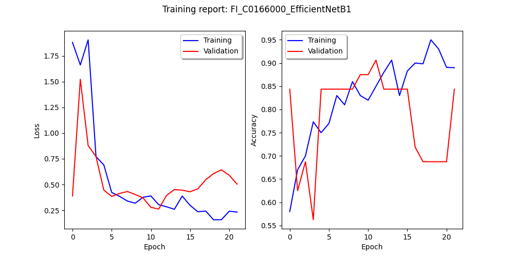
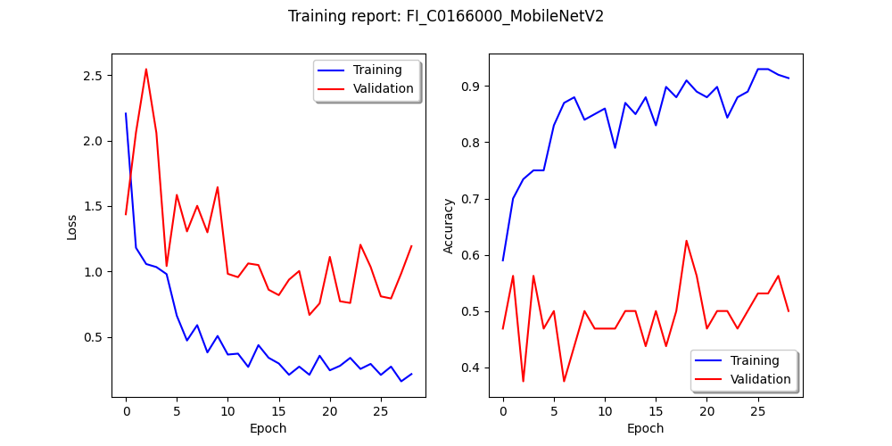

# Summary of model development

## Framework choice - Tensorflow (TF) 2.8.0 CPU-ONLY

We have a 500MB limitation on our free instance.

The first model developed was in TF 2.8.0, but the framework itself is +600MB, and we need to use other alternatives. We tried TF 2.4.0 (~430MB), but we use other Python libraries and need to host the model as well. Finally, we chose TF-cpu 2.8.0 for proof-of-concept because the framework size is 247 MB, which is fine for us. We chose TF 2.8.0 with GPU support for our state-of-the-art implementation to speed up training.

- proof-of-concept: [tensorflow-cpu 2.8.0](https://pypi.org/project/tensorflow-cpu/2.8.0/)
- state-of-the-art: [tensorflow 2.8.0](https://pypi.org/project/tensorflow/2.8.0/)

## Choice of base model

The choice of the base model followed the same pattern. We need a model with a suitable size for our 500MB instance, which has good accuracy. So we have a trade-off between size and performance.

The first model developed was based on [EfficientNetB7](https://arxiv.org/abs/1905.11946), which generated a model of >600MB and an accuracy of ~75% (this can change with the camera chosen and the number of images for training).

Our second test was with [EfficientNetB1](https://arxiv.org/abs/1905.11946), which yielded a 120MB model and ~64% accuracy. However, we would only be able to host one model for proof-of-concept with this model. In the end, we chose to use the [MobileNetV2](https://arxiv.org/abs/1801.04381) model (~45MB trained) for the 500MB instance.

For the state-of-the-art model, we chose EfficientNetB1 because with the scale up to hundreds or thousands of cameras, a model of this type (lightweight and effective) can be a plus.

- proof-of-concept: MobileNetV2
- state-of-the-art: EfficientNetB1

Finally, these models were trained with few images and little tuning. We believe that this performance can improve with more images and better fake images.

<!-- working on
## Train models

Usage:
> $ python path/to/train.py --basemodel MODEL --datapath path/to/data --cam COUNTRY_CAMERA --img SIZE --batch NUMBER --epoch NUMBER --reports all/text/graph

Example:
> $ python train.py --basemodel MobileNetV2 --datapath path/to/data --cam FI_C0166000 --img 160 --batch 4 --epoch 100 --reports all

-->
## Trained models

We trained several models, among which the EfficientNetB1 and MobileNetV2 stood out for their performance x computational cost.

The models were trained with few images, ~70 divided between training/validation/testing. 20% data augmentation was performed with shift (width/height), shear, zoom, and horizontal_flip techniques to improve performance.

Still, minimal tuning was done on the parameters. Thus, we believe that with the addition of images, with the improvement of fake images, and with the tuning of the models, we can achieve better results.

The training results for the EfficientNetB1 model are shown below.

Finally, the training results for the MobileNetV2 model follow.

## References:

1. Tan, M., & Le, Q. V. (2019). EfficientNet: Rethinking Model Scaling for Convolutional Neural Networks. Retrieved March 18, 2022, from https://arxiv.org/abs/1905.11946
2. Sandler, M., Howard, A. G., Zhu, M., Zhmoginov, A., & Chen, L.-C. (2018). Inverted Residuals and Linear Bottlenecks: Mobile Networks for Classification, Detection and Segmentation. Retrieved March 18, 2022, from https://arxiv.org/abs/1801.04381
3. Module: Tf.keras.applications: Tensorflow core v2.8.0. TensorFlow. Retrieved March 18, 2022, from https://www.tensorflow.org/api_docs/python/tf/keras/applications
4. Keras Documentation: Transfer Learning Fine-tuning. Keras. Retrieved March 18, 2022, from https://keras.io/guides/transfer_learning/
5. Transfer learning and fine-tuning: Tensorflow Core. TensorFlow. Retrieved March 19, 2022, from https://www.tensorflow.org/tutorials/images/transfer_learning
